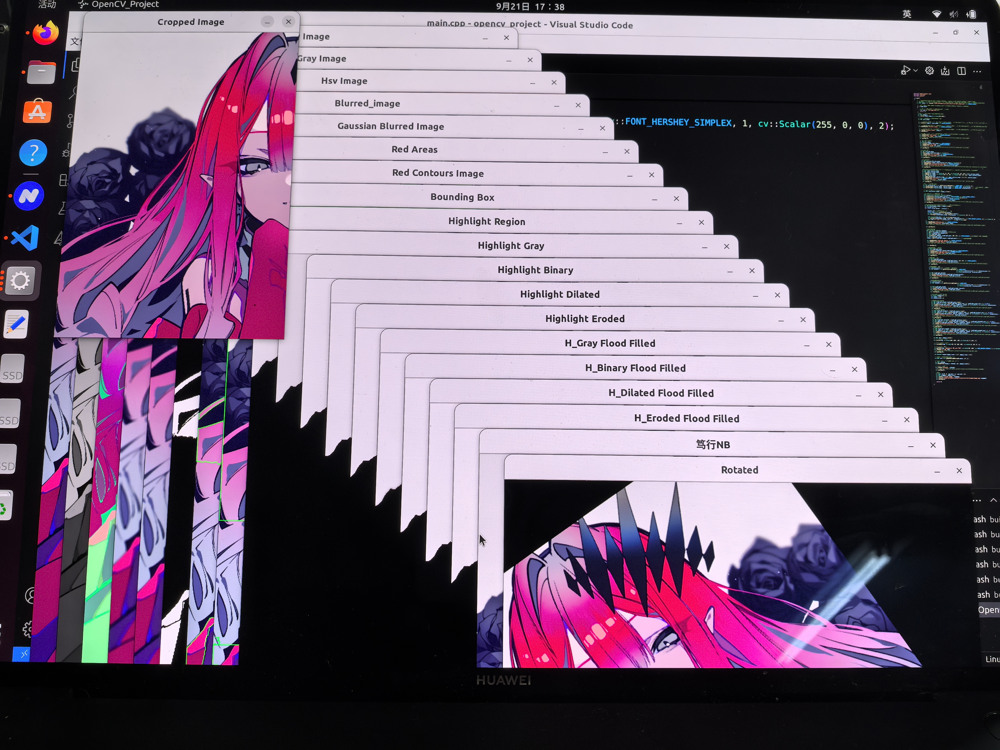

# <center><font face="仿宋" font color=orange>TASK 2</font>
## <center><font face="楷体" size=5>医电2403 曾一鸣</font></center>

### <center><font face="仿宋" font color=red size=3>总述</font></center>
本次任务没有过多的记录过程，主体通过查阅opencv官方文档以及询问GPT实现，程序的实现感觉也基本上是调用函数的过程，故没有什么特别的思路展示喵。

***程序运行生成的图像文件存放于 仓库/resources/out/***
***本人纯纯小白，以下仅为编写过程中的小小感想，还请学长们指教***
### <center><font face="仿宋" font color=red size=3>运行成果展示</font></center>


***每个步骤都设置了waitKey(0),故这些窗口并不是一次性打开的，而是按任意键逐一弹出的***


### 过程简要阐述
**:one:** **opencv库的安装**
通过查询组长的b站（==阿汐owo==）培训视频完成
*（linux的包管理系统实在是太方便了喵，配置过程比windows简单100万倍喵）*
**:two:** **程序编写**
- 不知是否为电脑显示器原因，在`imshow`的时候打开的图片窗口一直过大
  故一开始通过调用函数得知了原图的宽高比（约为0.7），想要更改图片大小但尽量不改变宽高比，如下
    ``` 
    //更改原图像的显示大小，但尽量不改变宽高比            
    cv::Mat image_1;              
    cv::resize(image,image_1,cv::Size(700,1000));    
    ```
    *但考虑到审核员的查看效果，最后还是没有更改*

- **寻找红色区域**
  图中存在大量红色区域，其中包括较深的红色及较浅的红色
  网上查询的红色hsv值大部分h值为0～10&160～180,而s和v值为0～255    
  但发现画出的边框并不太准确，于是对hsv值进行了微调

- **寻找bounding box**
  为了方便对应终端中输出的面积值以及图中的bounding box     
  对图中的boundingbox进行了编号，并显示在bounding box 旁边 

- **不知我是否对于任务要求理解有误，每一个步骤我均对处理后的图像做了`imshow`，并紧跟着一段`imwrite`的代码**
  
**:three:** **个人收获**
- 了解到了cmake的原理
- 对ubuntu系统的命令行使用更为熟练，更加了解了这个系统
- 个人感觉这样学习编程的过程是最快的，在做项目的过程中学习，学到的知识可以直接运用于实践，及时反馈强，成就感高。